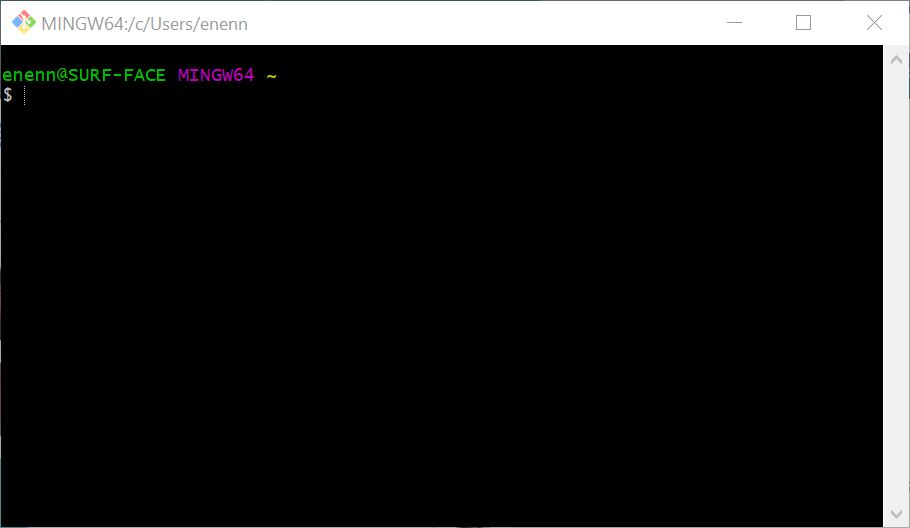
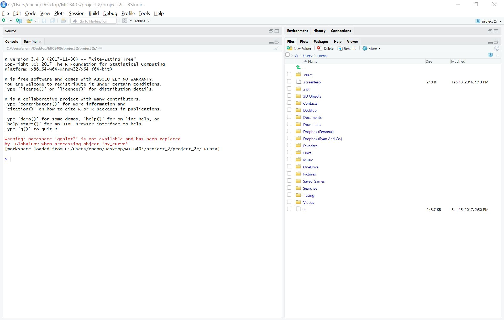

```{r setup, include=FALSE}
knitr::opts_chunk$set(echo = TRUE)
```

# Module 01

## Module 01 Portfolio Check

* Installation check
    + Completion status:
    + Comments:
* Portfolio repo setup
    + Completion status: 
    + Comments:
* RMarkdown Pretty PDF Challenge
    + Completion status:
    + Comments:
* Evidence worksheet_01
    + Completion status:
    + Comments:
* Evidence worksheet_02
    + Completion status:
    + Comments:
* Evidence worksheet_03
    + Completion status:
    + Comments:
* Problem Set_01
    + Completion status:
    + Comments:
* Problem Set_02
    + Completion status:
    + Comments:
* Writing assessment_01
    + Completion status:
    + Comments:
* Additional Readings
    + Completion status:
    + Comments:  

## Data Science Friday 

### Installation check
Use this space to include your installation screenshots.






### Portfolio repo setup
Detail the code you used to create, initialize, and push your portfolio repo to GitHub. This will be helpful as you will need to repeat many of these steps to update your porfolio throughout the course.

```{r gitsetup, eval=FALSE}
$ mkdir MICB425_portfolio #make portfolio directory within desired directory
$ cd MICB425_portfolio #go to new directory
$ git init #designate it as a repo
$ touch ID.txt #create blank ID.txt file
$ git add . #stage all files in new repo for commit
$ git commit -m "First commit" #commit files
$ git remote add origin https://github.com/ryankn/MICB425_portfolio #designate remote repo URL
$ git remove -v #verify remote repo URL
$ git push -u origin master #push local repo to remote repo
```

### RMarkdown pretty PDF challenge
Paste your code from the in-class activity of recreating the example PDF.

```{r prettypdf, child='DS_Assignment3.Rmd', toc=FALSE}
```

## Origins and Earth Systems
### Evidence worksheet 01 
The first thing for any assignment should link(s) to any relevant literature (which should be included as full citations in a module references section below).

As you include Evidence worksheets and Problem sets in the future, ensure that you delineate Questions/Learning Objectives/etc. by using headers that are 4th level and greater. This will still create header markings when you render (knit) the document, but will exclude these levels from the Table of Contents. That's a good thing. You don't want to clutter the Table of Contents too much.

[Whitman *et al* 1998](https://www.ncbi.nlm.nih.gov/pmc/articles/PMC33863/)

#### Learning objectives
Describe the numerical abundance of microbial life in relation to ecology and biogeochemistry of Earth systems. 

#### General questions
* What were the main questions being asked?  
What is the total number of prokaryotes and the total amount of their cellular carbon on earth?

* What were the primary methodological approaches used?  
To make calculation of such figures more plausible, the number of prokaryotes in three large habitats in which current knowledge suggests most prokaryotes reside in were examined, namely: aquatic environments, soil, and the subsurface. All numbers were used from previously published papers reporting various figures like CFU/mL counts, volume estimations, or C content. 

* Summarize the main results or findings.  

* Do new questions arise from the results?  

* Were there any specific challenges or advantages in understanding the paper (*e.g.* did the authors provide sufficient background information to understand experimental logic, were methods explained adequately, were any specific assumptions made, were conclusions justified based on the evidence, were the figures or tables useful and easy to understand)?  


### Problem set 01
#### Learning objectives: 
Describe the numerical abundance of microbial life in relation to the ecology and biogeochemistry of Earth systems.

#### Specific questions:
* What are the primary prokaryotic habitats on Earth and how do they vary with respect to their capacity to support life? Provide a breakdown of total cell abundance for each primary habitat from the tables provided in the text.  

Habitat    | Abundance
---------- | ---------
Aquatic    | 1.161 x 10^29^
Soil       | 2.556 x 19^29^
Subsurface | 3.8 x 10^30^


* What is the estimated prokaryotic cell abundance in the upper 200 m of the ocean and what fraction of this biomass is represented by marine cyanobacterium including *Prochlorococcus*? What is the significance of this ratio with respect to carbon cycling in the ocean and the atmospheric composition of the Earth?  
3.6x10^28^ cells, at 5x10^5^ cells/mL of Cyanobacteria is 8%

4x10^4^ cells/mL divided by 5x10^5^ cells/mL = 8%

* What is the difference between an autotroph, heterotroph, and a lithotroph based on information provided in the text?  
autotroph fix inorganic carbon e.g. CO2 into biomass, heterotroph assimilate organic carbon,
lithotroph consumes inorganic substrates

* Based on information provided in the text and your knowledge of geography what is the deepest habitat capable of supporting prokaryotic life? What is the primary limiting factor at this depth?  
subsurface deep habitats, both terrestrial and marine
terrestrial and marine: up to 4 km, limiting factor is temperature of 125 degrees C
temperature changes about 22 C per km

marianas trench - how deep is it? 10.9 km

* Based on information provided in the text and your knowledge of geography what is the highest habitat capable of supporting prokaryotic life? What is the primary limiting factor at this height?  

mount everest - 8.8 km
is anything really alive up in the atmosphere at 77 km? that doesn't seem likely - lack of nutrients or moisture, then there's lots of UV radiation too, sketchy. Let's say 20 km. 

* Based on estimates of prokaryotic habitat limitation, what is the vertical distance of the Earth's biosphere measured in km?  
Thus the vertical distance is about 24 km from top to bottom (tip of mount everest to 4-5 km under marianas trench)

* How was annual cellular production of prokaryotes described in Table 7 column four determined? (Provide an example of the calculation)  
Annual cellular production of prokaryotes was calculated based on literature values for population size and population turnover time in days. In the following example calculation, population size is P, turnover time is T, and annual cellular production is A.  

$$A=P*\frac{365}{T}$$
3.6x10^28^ cells * 365 days / 16 turnovers = 8.2x10^29^ cells/year

* What is the relationship between carbon content, carbon assimilation efficiency and turnover rates in the upper 200m of the ocean? Why does this vary with depth in the ocean and between terrestrial and marine habitats?  
assuming carbon efficiency is 20%, so net productivity required is 4x (why not 5? confusion)
assume C content per cell of say 10 fg/cell, which is around 20x10^-30^ Pg/cell
multiply # of cells (3.6x10^28^ cells) by C content per cell, which comes up to about 0.72 Pg C in marine heterotrophs

0.72*4 = 2.88 Pg C per year

51 Pg C per year of productivity * 85% = 43 Pg C per year goes to upper 200m
43/2.88 = 14.9 turnovers a year
365/14.9 = 24.5 days per turnover

why does this vary with depth? different production and consumption of C in different habitats

Carbon assimilation efficiency and carbon content determine turnover rates in the upper 200m of the ocean. The amount of net primary productivity required to sustain prokaryotic turnover is dependent on both C assimilation efficiency and total carbon content of the population, which then sets an upper limit on turnover rates. These vary between habitats because different assimilation efficiencies and total carbon content, as well as the amount of total net primary productivity each habitat zone consumes. 

also viruses - the viruses kill bugs causing turnover, and carry assessory metabolic genes that when they infect cells, supplement the various metabolic capacities of the community

* How were the frequency numbers for four simultaneous mutations in shared genes determined for marine heterotrophs and marine autotrophs given an average mutation rate of 4 x 10^-7^ per DNA replication? (Provide an example of the calculation with units. Hint: cell and generation cancel out)  

4x10^-7^ mutations/generation

(4x10^-7^)^4^ = 2.56 x 10^-26^ mutations/generation

365/16 = 22.8 turnovers per year

3.1 x 10^28^ cells * 22.8 = 8.2x10^29^ cells/year

8.2x10^29^ cells/year x 2.56 x 10^-26^ mutations/generation = 2.1x10^4^ mutations/year

convert to hours - divide by 365x24 

2.1x10^4^ / 365 / 24 = 2.4 mutations/hour

1/2.4 = 0.4 hours/mutation

* Given the large population size and high mutation rate of prokaryotic cells, what are the implications with respect to genetic diversity and adaptive potential? Are point mutations the only way in which microbial genomes diversify and adapt?  


* What relationships can be inferred between prokaryotic abundance, diversity, and metabolic potential based on the information provided in the text? 


### Module 01 references
Utilize this space to include a bibliography of any literature you want associated with this module. We recommend keeping this as the final header under each module.

An example for Whitman and Wiebe (1998) has been included below.

Whitman WB, Coleman DC, and Wiebe WJ. 1998. Prokaryotes: The unseen majority. Proc Natl Acad Sci USA. 95(12):6578-6583.  [PMC33863](https://www.ncbi.nlm.nih.gov/pmc/articles/PMC33863/)